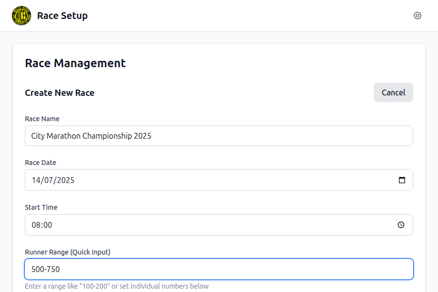

# Production Deployment Guide

This project is configured to automatically deploy to production (https://wicen.bwhite.id.au/) when specific conditions are met.

## Deployment Triggers

The deployment workflow will run when:

1. **Version Tag**: A new version tag is pushed (format: `v*.*.*`, e.g., `v1.0.0`, `v2.1.3`)
2. **Main Branch**: The tag must be on the `main` branch
3. **Tests Run**: Tests are executed but deployment continues even if some tests fail (with warnings)

## How to Deploy

### Step 1: Test Your Changes
Before creating a release, run tests locally to check for issues:
```bash
npm run test:run
```

**Note**: The deployment will proceed even if some tests fail, but you should aim to fix test issues for better code quality.

### Step 2: Build and Test Locally
Verify the production build works correctly:
```bash
NODE_ENV=production npm run build
```

### Step 3: Create and Push a Version Tag
```bash
# Create a new version tag
git tag v1.0.0

# Push the tag to GitHub
git push origin v1.0.0
```

### Step 4: Monitor Deployment
1. Go to your repository's **Actions** tab
2. Watch the "Deploy to GitHub Pages" workflow
3. The workflow will:
   - Run all tests (with warnings if they fail)
   - Build the production application
   - Deploy to GitHub Pages

## Workflow Details

### Two-Stage Process
1. **Test Stage**: Runs on every push to main and every tag
   - Installs dependencies
   - Runs the full test suite (`npm run test:run`)
   - Continues even if tests fail (with warnings)
   
2. **Build & Deploy Stage**: Only runs for version tags
   - Builds the production application for root domain deployment
   - Deploys to production

### Production Configuration
- **Source**: GitHub Actions
- **URL**: `https://wicen.bwhite.id.au/`
- **Base Path**: `/` (root domain deployment)

## Setting Up Production Deployment (One-time Setup)

1. Go to your repository **Settings**
2. Navigate to **Pages** in the sidebar
3. Under **Source**, select "GitHub Actions"
4. Save the settings
5. Configure your domain (wicen.bwhite.id.au) to point to the GitHub Pages deployment

## Manual Deployment

You can also trigger deployment manually:
1. Go to **Actions** tab in your repository
2. Select "Deploy to GitHub Pages" workflow
3. Click "Run workflow"
4. Choose the branch (should be `main`)
5. Click "Run workflow"

## Current Test Status

⚠️ **Important**: Some tests are currently failing due to:
- Missing function implementations in the store
- Test environment configuration issues
- Component testing setup problems

The deployment workflow is configured to continue despite test failures, but these should be addressed:

### Known Test Issues
1. **Header Component**: `getRunnerCounts` function not found
2. **ImportExportModal**: DOM element creation issues in tests
3. **Settings Modal**: Database connection issues in test environment
4. **Storage Service**: Mock configuration problems

### Recommended Actions
1. Fix the `getRunnerCounts` function in the race store
2. Update test setup for proper DOM handling
3. Configure test database mocking correctly
4. Review and update component test implementations

## Troubleshooting

### Build Failing
- Ensure `npm run build` works locally
- Check for any missing dependencies
- Review build logs in the Actions tab

### Deployment Not Triggering
- Ensure tag follows `v*.*.*` format (e.g., `v1.0.0`)
- Verify tag is pushed to the repository
- Check that GitHub Pages is configured correctly

### PWA Not Working
- Verify service worker is properly generated
- Check manifest.json is accessible at the root domain
- Ensure HTTPS is enabled (required for PWA functionality)

## Version Management

### Semantic Versioning
Use semantic versioning for tags:
- `v1.0.0` - Major release
- `v1.1.0` - Minor release (new features)
- `v1.0.1` - Patch release (bug fixes)

### Example Release Process
```bash
# Make your changes and commit them
git add .
git commit -m "Add new feature"
git push origin main

# Create and push a version tag
git tag v1.1.0
git push origin v1.1.0
```

The deployment will automatically start and your changes will be live at `https://wicen.bwhite.id.au/` once complete.

## Testing the Deployment

After deployment, verify:
1. Application loads correctly at https://wicen.bwhite.id.au/
2. All assets (CSS, JS, images) load properly
3. PWA functionality works (offline capability, install prompt)
4. Navigation and core features function as expected

### Visual Verification Checklist

Use these screenshots as reference to verify the deployed application matches expected functionality:

#### Core Application Flow

*Verify clean startup interface loads correctly*


*Confirm race creation form displays properly*


*Test real-time calculations work correctly*

#### Operation Modes

*Verify mode selection interface appears after race creation*


*Test checkpoint mode functionality and runner grouping*


*Confirm base station data entry interface works*

#### Advanced Features

*Verify statistics and race management features*


*Test settings modal and customization options*


*Confirm dark mode theme consistency*


*Verify complete application functionality*

### Deployment Verification Steps
1. **Initial Load**: Compare with Screenshot 1 - clean startup interface
2. **Race Creation**: Test form functionality against Screenshots 2-3
3. **Mode Selection**: Verify interface matches Screenshot 4
4. **Feature Testing**: Test both checkpoint and base station modes (Screenshots 5-6)
5. **Settings**: Verify customization options work (Screenshots 8-9)
6. **Theme Switching**: Test dark/light mode functionality
7. **Overall Functionality**: Ensure all features work as shown in screenshots
