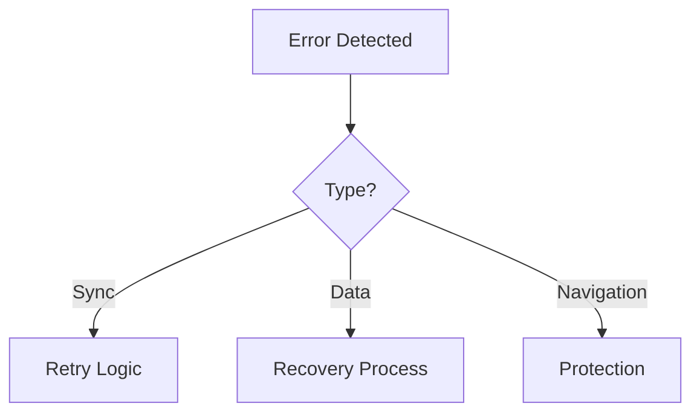

# Race Tracker Implementation Documentation

## Architecture Changes

### 1. Module Isolation
The application has been restructured into three isolated modules:

```
src/
├── modules/
│   ├── race-maintenance/    # Race setup and configuration
│   ├── checkpoint-operations/ # Checkpoint tracking
│   └── base-operations/     # Base station operations
└── shared/                  # Shared resources
```

#### Key Benefits:
- Independent operation of modules
- Protected data during operations
- Clear separation of concerns
- Improved maintainability

### 2. Data Architecture

#### Database Layer
- Shared IndexedDB through Dexie.js
- Module-specific repositories
- Consistent data access patterns
```javascript
// Example repository pattern
class BaseRepository {
  constructor(tableName) {
    this.table = db[tableName];
  }
  // Common CRUD operations
}
```

#### State Management
- Module-specific stores using Zustand
- Shared settings store
- Navigation state management
```javascript
// Example store structure
const useModuleStore = create((set) => ({
  // Module-specific state
  // Actions
  // Selectors
}));
```

### 3. Navigation Protection

#### Protected Routes
- Module-specific route protection
- Operation state tracking
- Safe exit handling
```javascript
<ProtectedRoute moduleType={MODULE_TYPES.CHECKPOINT}>
  <CheckpointView />
</ProtectedRoute>
```

#### Exit Handling
- Unsaved changes protection
- Confirmation dialogs
- Clean state reset
```javascript
const withOperationExit = (Component) => {
  // Exit handling logic
  // Unsaved changes tracking
  // Navigation protection
};
```

### 4. Testing Infrastructure

#### Test Organization
```
src/test/
├── integration/           # Integration tests
├── ModuleIsolation.test  # Isolation tests
├── ExitOperation.test    # Exit handling tests
└── NavigationStore.test  # Navigation state tests
```

#### Coverage Areas
- Module isolation
- Data synchronization
- Operation safety
- Navigation protection

### 5. CI/CD Pipeline

#### Workflow Stages
1. Test execution
2. Build verification
3. Staged deployment
4. Health checks
5. Notifications

## Module Details

### 1. Race Maintenance

#### Responsibilities:
- Race configuration
- Runner setup
- Checkpoint definition
- Initial data setup

#### Key Components:
```javascript
// RaceMaintenanceRepository
class RaceMaintenanceRepository extends BaseRepository {
  async createRace(config) { /* ... */ }
  async updateCheckpoints(checkpoints) { /* ... */ }
  // ...
}
```

### 2. Checkpoint Operations

#### Responsibilities:
- Runner tracking
- Status updates
- Data synchronization
- Local operation management

#### Key Components:
```javascript
// CheckpointRepository
class CheckpointRepository extends BaseRepository {
  async markRunner(number, status) { /* ... */ }
  async syncWithBase() { /* ... */ }
  // ...
}
```

### 3. Base Operations

#### Responsibilities:
- Central data management
- Race overview
- Report generation
- Multi-checkpoint coordination

#### Key Components:
```javascript
// BaseOperationsRepository
class BaseOperationsRepository extends BaseRepository {
  async consolidateData() { /* ... */ }
  async generateReports() { /* ... */ }
  // ...
}
```

## Data Flow

### 1. Normal Operation


### 2. Error Handling


## Migration Guide

### 1. Database Updates
- Schema version 5
- New indices for performance
- Data migration utilities

### 2. Component Updates
- Convert to module structure
- Implement protected routes
- Add exit handling

### 3. State Management
- Move to module stores
- Implement shared stores
- Update component bindings

## Best Practices

### 1. Module Development
- Keep modules independent
- Use shared utilities
- Implement proper exit handling
- Maintain test coverage

### 2. Data Handling
- Use repositories
- Implement proper sync
- Handle errors gracefully
- Maintain consistency

### 3. Testing
- Test isolation
- Verify data flow
- Check error handling
- Maintain coverage

## Performance Considerations

### 1. Data Management
- Efficient queries
- Proper indexing
- Batch operations
- Cache management

### 2. UI Performance
- Lazy loading
- State optimization
- Render optimization
- Event debouncing

## Security Measures

### 1. Data Protection
- Operation isolation
- Validation checks
- Error boundaries
- Safe exit handling

### 2. Navigation Safety
- Protected routes
- State validation
- Operation guards
- Exit confirmation

## Maintenance

### 1. Regular Tasks
- Update dependencies
- Review test coverage
- Monitor performance
- Update documentation

### 2. Troubleshooting
- Check logs
- Verify state
- Test isolation
- Review data flow

## Future Considerations

### 1. Potential Improvements
- Real-time sync
- Offline support
- Performance monitoring
- Advanced reporting

### 2. Scalability
- Multiple races
- More checkpoints
- Data archiving
- Advanced analytics

## Support

### 1. Documentation
- Code comments
- API documentation
- Test documentation
- Troubleshooting guide

### 2. Resources
- Test suite
- CI/CD pipeline
- Development guides
- Best practices
