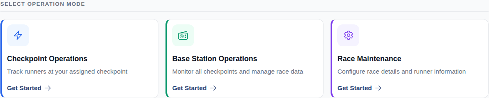
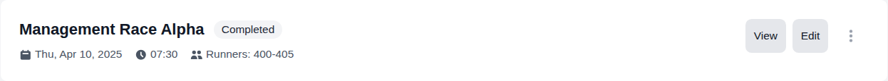
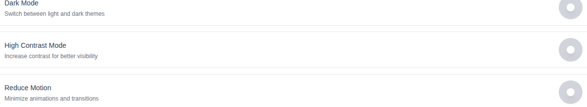

# 🏃 RaceTracker Pro

[](https://opensource.org/licenses/MIT)
[](https://reactjs.org/)
[](https://vitejs.dev/)
[](https://web.dev/progressive-web-apps/)
[](https://github.com/bwhite001/RaceTrackers/actions/workflows/ci.yml)
[](https://github.com/bwhite001/RaceTrackers/actions/workflows/test-suites.yml)

> **Offline-first Progressive Web App for race event management**  
> Track runners at checkpoints and manage race operations without internet connectivity.

---

## 📋 Table of Contents

- [Overview](#overview)
- [Features](#features)
- [Demo](#demo)
- [Quick Start](#quick-start)
- [Installation](#installation)
- [Usage](#usage)
- [Development](#development)
- [Testing](#testing)
- [Deployment](#deployment)
- [Documentation](#documentation)
- [Contributing](#contributing)
- [License](#license)

---

## 🎯 Overview

**RaceTracker Pro** is a comprehensive race tracking system designed for volunteers and coordinators managing running events. Built as a Progressive Web App (PWA), it provides full offline functionality, making it ideal for remote race locations with limited or no internet connectivity.

### Key Capabilities

- **Offline-First Architecture**: Complete functionality without internet
- **Dual Operation Modes**: Checkpoint tracking and Base Station management
- **Real-Time Analytics**: Live leaderboards and progress tracking
- **Data Portability**: JSON export/import with validation
- **Scalable**: Supports 1,000-2,000+ runners across multiple checkpoints
- **Cross-Platform**: Works on desktop, tablet, and mobile devices

---

## ✨ Features

### 🏁 Race Setup & Configuration
- Create and configure races with custom runner ranges
- Define multiple checkpoints with custom names
- Import/export race configurations
- Support for CSV/Excel runner data import

### 📍 Checkpoint Operations
- **Runner Mark-Off**: Quick tap interface for tracking runner arrivals
- **Callout Sheet**: Automatic 5-minute time grouping for efficient reporting
- **Overview Dashboard**: Real-time status tracking with color-coded indicators

### 🎯 Base Station Operations
- **Bulk Data Entry**: Efficient time assignment for multiple runners
- **Race Overview**: Comprehensive dashboard with live statistics
- **Withdrawal Management**: Track DNF, DNS, and withdrawn runners
- **Strapper Calls**: Manage medical and support requests
- **Report Generation**: Create detailed race reports and analytics

### 🎨 User Experience
- **Dark/Light Mode**: Customizable theme preferences
- **Responsive Design**: Optimized for all screen sizes
- **Accessibility**: WCAG 2.1 AA compliant
- **Keyboard Shortcuts**: Efficient navigation and operations
- **Offline Storage**: IndexedDB for reliable local data persistence

---

## 🚀 Demo

### Live Demo
🔗 **[Try RaceTracker Pro](https://racetrackers.bwhite.id.au/)** *(Live App)*

### App Screenshots

| Home — Module Cards | Race Setup Wizard |
|---|---|
|  |  |

| Race Overview | Race Management |
|---|---|
|  |  |

| Checkpoint — Runner Grid | Checkpoint — Quick Entry |
|---|---|
|  |  |

| Checkpoint — Callout Sheet | Settings Panel |
|---|---|
|  |  |

---

## ⚡ Quick Start

### Prerequisites
- **Node.js** 18+ and npm 9+
- Modern web browser (Chrome, Firefox, Safari, Edge)

### Installation

```bash
# Clone the repository
git clone https://github.com/bwhite001/RaceTrackers.git
cd RaceTrackers

# Install dependencies
npm install

# Start development server
npm run dev
```

The app will be available at `http://localhost:3000`

### Build for Production

```bash
# Create optimized production build
npm run build

# Preview production build locally
npm run preview
```

---

## 📦 Installation

### Development Setup

1. **Clone the repository**
   ```bash
   git clone https://github.com/bwhite001/RaceTrackers.git
   cd RaceTrackers
   ```

2. **Install dependencies**
   ```bash
   npm install
   ```

3. **Configure environment** (optional)
   ```bash
   cp .env.example .env
   # Edit .env with your settings
   ```

4. **Start development server**
   ```bash
   npm run dev
   ```

### Production Deployment

See [Deployment Guide](./docs/guides/deployment-guide.md) for detailed instructions on deploying to:
- GitHub Pages
- Netlify
- Vercel
- Self-hosted servers

---

## 💻 Usage

### Creating a Race

1. Launch the application
2. Click **"Create New Race"**
3. Enter race details:
   - Race name
   - Date and start time
   - Runner number range (e.g., 1-128)
4. Configure checkpoints
5. Save configuration

### Checkpoint Mode

**For volunteers at race checkpoints:**

1. Select **Checkpoint Mode**
2. Choose your checkpoint
3. **Mark-Off Tab**: Tap runner numbers as they pass
4. **Callout Sheet Tab**: View grouped times for reporting
5. **Overview Tab**: Monitor all runner statuses

### Base Station Mode

**For central race operations:**

1. Select **Base Station Mode**
2. **Data Entry Tab**: Enter finish times and runner numbers
3. **Overview Tab**: Monitor race progress and statistics
4. Generate reports and manage withdrawals

### Keyboard Shortcuts

| Shortcut | Action |
|----------|--------|
| `Ctrl/Cmd + K` | Quick search |
| `Ctrl/Cmd + N` | New entry |
| `Ctrl/Cmd + S` | Save/Export |
| `Ctrl/Cmd + P` | Print report |
| `Esc` | Close dialog |

📖 [Full User Guide](./docs/guides/user-guide.md)

---

## 🛠 Development

### Project Structure

```
RaceTrackers/
├── config/              # Suite-specific Vitest configurations
├── docs/                # Documentation
│   ├── guides/          # User guides, journey walkthroughs, PDFs
│   └── plans/           # Local-only planning docs (gitignored)
├── public/              # Static assets
├── scripts/             # Build and utility scripts
├── src/                 # Source code
│   ├── components/      # Shared React components
│   ├── design-system/   # Design system (Button, Card, Modal, etc.)
│   ├── modules/         # Feature modules (base-operations, checkpoint, race-maintenance)
│   ├── services/        # Business logic and StorageService
│   ├── shared/          # Shared utilities, DB schema, navigation store
│   ├── store/           # Global Zustand stores (useRaceStore)
│   ├── types/           # Constants, enums, JSDoc types
│   ├── utils/           # Utility functions (csvImport, timeUtils, etc.)
│   └── views/           # Top-level views (LiveDashboard, Leaderboard, etc.)
├── test/                # Test suites
│   ├── base-operations/ # Base station tests
│   ├── checkpoint/      # Checkpoint module tests
│   ├── components/      # Shared component tests
│   ├── database/        # Database schema and migration tests
│   ├── e2e/             # End-to-end Playwright/Puppeteer tests
│   ├── integration/     # Cross-module integration tests
│   ├── race-maintenance/# Race setup module tests
│   └── services/        # Service layer tests
└── index.html           # Entry point
```

### Technology Stack

#### Core
| Category | Technology | Version |
|----------|-----------|---------|
| **UI Framework** | React | 18.2 |
| **Router** | React Router | 7.9 |
| **Build Tool** | Vite | 7.0 |
| **Styling** | Tailwind CSS | 3.3 |
| **State Management** | Zustand | 4.4 |
| **Database** | Dexie.js (IndexedDB) | 3.2 |
| **PWA** | vite-plugin-pwa + Workbox | 1.0 |
| **Icons / UI** | Heroicons + Headless UI | 2.x |
| **Date Handling** | date-fns | 2.30 |
| **QR Codes** | qrcode.react + jsQR | 3.1 / 1.4 |
| **Validation** | Zod | 4.1 |
| **Encryption** | crypto-js | 4.2 |

#### Testing
| Tool | Purpose | Version |
|------|---------|---------|
| Vitest | Unit & integration tests | 3.2 |
| React Testing Library | Component testing | 16.3 |
| Puppeteer | E2E browser automation | 24 |
| Playwright | E2E test runner | 1.58 |
| fake-indexeddb | In-memory IndexedDB shim | 6.2 |

#### Language
Plain JavaScript with JSDoc type annotations and prop-types — no TypeScript.

---

### Colour System

#### Brand — Navy Blue
`primary-*` and `navy-*` are identical aliases in Tailwind.

| Scale | Hex | Usage |
|-------|-----|-------|
| `navy-900` | `#263454` | Primary buttons, nav headers |
| `navy-800` | `#293c64` | Button hover, dark-mode surfaces |
| `navy-700` | `#2e4677` | Dark panels |
| `navy-500` | `#4a6faf` | Focus rings, mid tones |
| `navy-300` | `#9fb5da` | Light accents |
| `navy-50` | `#f4f6fb` | Tinted backgrounds |

#### Accents
| Name | Hex | Usage |
|------|-----|-------|
| `accent-red-600` | `#dc2626` | Danger buttons, errors |
| `gold-500` / `accent-gold-500` | `#f59e0b` | Warning buttons, DNF badges |

#### Runner Status Colours
Fixed semantic colours used across all modules (user-customisable in Settings):

| Status | Colour | Hex |
|--------|--------|-----|
| Not Started | Gray | `#9ca3af` |
| Passed / Active | Emerald | `#10b981` |
| Non-Starter | Red | `#ef4444` |
| DNF | Amber | `#f59e0b` |
| Called In | Violet | `#8b5cf6` |

#### Surfaces
| Token | Value | Usage |
|-------|-------|-------|
| `page-bg` | `#f1f5f9` | Page background (slate-100) |
| `surface` | `#ffffff` | Cards and panels |

---

### UI Design Principles

- **Dark mode** — class-based toggle (`dark:`); dark surfaces use `navy-800/900/950`
- **Typography** — native system font stack (no web fonts loaded); monospace for runner numbers
- **Border radius** — `rounded-lg` (8 px) throughout
- **Shadows** — `shadow-md` on buttons, `shadow-lg` on hover; subtle card elevation
- **Transitions** — `duration-200` on all interactive elements
- **Focus** — `focus:ring-2 focus:ring-navy-500` for full keyboard accessibility
- **Layout** — responsive Tailwind breakpoints; optimised for tablet/mobile field use
- **Components** — design system in `src/design-system/`: Button (8 variants), Card, Modal, Badge, Container, full Form suite

#### Button Variants
| Variant | Appearance |
|---------|-----------|
| `primary` | Navy-900 fill, white text |
| `secondary` | Gray fill, dark text |
| `danger` | Red-600 fill, white text |
| `success` | Green-600 fill, white text |
| `warning` | Gold-500 fill, white text |
| `ghost` | Transparent, hover gray tint |
| `outline` | Navy border, fills navy on hover |
| `link` | Transparent, underline on hover |

---

### Available Scripts

Prefer `make` — run `make help` to list all targets.

#### Development
```bash
make install             # Install dependencies
make dev                 # Start dev server (localhost:3000)
make build               # Production build
make preview             # Build and serve locally (localhost:4173)
make clean               # Remove build artefacts
```

#### Testing
```bash
make test                # Watch mode
make test-run            # Run once
make test-coverage       # With coverage report
make test-unit           # Unit tests
make test-base           # Base station tests
make test-db             # Database tests
make test-integration    # Integration tests
make test-services       # Service layer tests
make test-components     # Component tests
make test-e2e            # E2E (auto-builds first)
make test-e2e-ci         # E2E headless
make test-changed        # Only tests affected by uncommitted changes
```

#### Test Data
```bash
make seed                # Seed full dataset into IndexedDB
make seed-minimal        # Seed minimal dataset
make clear-data          # Clear all test data
```

📖 [Development Guide](./docs/guides/development-guide.md)

---

## 🧪 Testing

### Test Coverage

The project maintains **>85% test coverage** across all modules (663+ tests):

- **Unit Tests**: Component and utility testing
- **Integration Tests**: Module interaction testing
- **E2E Tests**: Complete workflow testing
- **Database Tests**: Schema and data integrity testing

### Running Tests

```bash
# Run all tests
npm test

# Run specific test suite
npm run test:suite:base-operations

# Run with coverage
npm run test:coverage

# Run E2E tests
npm run test:e2e
```

### Test Organization

```
test/
├── base-operations/     # Base station component tests
├── database/            # Database schema and operations
├── e2e/                 # End-to-end workflow tests
├── integration/         # Cross-module integration tests
├── services/            # Service layer tests
└── unit/                # Unit tests
```

📖 [Testing Guide](./docs/guides/testing-guide.md)  
📊 [Test Report](./docs/testing/test-report.md)

---

## 🚀 Deployment

### GitHub Pages (Recommended)

The app is deployed automatically via GitHub Actions on every push to `main`.

1. **Configure GitHub Pages**
   - Go to repository Settings → Pages
   - Source: GitHub Actions
   - Custom domain: `racetrackers.bwhite.id.au`

2. **DNS setup** — add a CNAME record:
   ```
   racetrackers  CNAME  bwhite001.github.io
   ```

3. **Deploy**
   ```bash
   # Push to main branch - GitHub Actions deploys automatically
   git push origin main
   ```

4. **Live URL**
   ```
   https://racetrackers.bwhite.id.au/
   ```

> Visiting any other URL (e.g. the old `github.io` address) will redirect automatically to the canonical domain.

### CI / Branch Protection

PRs to `main` must pass two required status checks before merging:

| Check | What it does |
|-------|-------------|
| **CI Gate** (`ci.yml`) | Runs all 663+ tests split across **4 parallel shards** + build verification |
| **Suites Gate** (`test-suites.yml`) | Runs `unit`, `base-operations`, `database`, `integration`, `services` suites **in parallel** |

To enforce this, enable branch protection on `main` in repository Settings → Branches and add `CI Gate` and `Suites Gate` as required status checks.

### Manual Deployment

```bash
# Build for production
npm run build

# Deploy dist/ folder to your hosting service
```

### Environment Variables

```bash
# .env
VITE_APP_VERSION=1.0.0
VITE_API_URL=https://api.example.com  # Optional
```

📖 [Deployment Guide](./docs/guides/deployment-guide.md)

---

## 📚 Documentation

### User Guides
- 📖 [User Guide](./docs/guides/user-guide.md) — Complete user manual
- 🏁 [Race Day Operations](./docs/guides/race-day-operations.md) — Race day workflows and procedures
- 🎯 [Race Director Journey](./docs/guides/journey-race-director.html) — Visual walkthrough for race directors
- 📍 [Checkpoint Volunteer Journey](./docs/guides/journey-checkpoint-volunteer.html) — Checkpoint operator guide
- 🏟️ [Base Station Journey](./docs/guides/journey-base-station.html) — Base station operator guide

### PDF Quick Reference
- 📄 [Race Setup Guide (PDF)](./docs/guides/user-guide-setup.pdf)
- 📄 [Checkpoint Operations (PDF)](./docs/guides/user-guide-checkpoint.pdf)
- 📄 [Navigation Reference (PDF)](./docs/guides/user-guide-navigation.pdf)
- 📄 [Settings Reference (PDF)](./docs/guides/user-guide-settings.pdf)

### Technical Reference
- 🏗️ [App Architecture](./docs/RaceTrackerApp.md) — Architecture and design decisions
- 📋 [Complete Journey Guide](./docs/RaceTrackerProCompleteUserJourneyGuide.md) — End-to-end race workflow

---

## 🤝 Contributing

We welcome contributions! Please follow these guidelines:

### Getting Started

1. Fork the repository
2. Create a feature branch (`git checkout -b feature/amazing-feature`)
3. Make your changes
4. Write/update tests
5. Ensure all tests pass (`npm test`)
6. Commit your changes (`git commit -m 'Add amazing feature'`)
7. Push to the branch (`git push origin feature/amazing-feature`)
8. Open a Pull Request

### Development Guidelines

- Follow existing code style and patterns
- Maintain test coverage >85%
- Update documentation for new features
- Add tests for bug fixes
- Use meaningful commit messages

### Code Style

- **JavaScript/React**: ESLint configuration
- **CSS**: Tailwind CSS utilities
- **Testing**: Vitest + React Testing Library patterns

📖 [Contributing Guide](./CONTRIBUTING.md)

---

## 📄 License

This project is licensed under the **MIT License** - see the [LICENSE](./LICENSE) file for details.

```
MIT License

Copyright (c) 2025 Brandon Johnston

Permission is hereby granted, free of charge, to any person obtaining a copy
of this software and associated documentation files (the "Software"), to deal
in the Software without restriction, including without limitation the rights
to use, copy, modify, merge, publish, distribute, sublicense, and/or sell
copies of the Software, and to permit persons to whom the Software is
furnished to do so, subject to the following conditions:

The above copyright notice and this permission notice shall be included in all
copies or substantial portions of the Software.

THE SOFTWARE IS PROVIDED "AS IS", WITHOUT WARRANTY OF ANY KIND, EXPRESS OR
IMPLIED, INCLUDING BUT NOT LIMITED TO THE WARRANTIES OF MERCHANTABILITY,
FITNESS FOR A PARTICULAR PURPOSE AND NONINFRINGEMENT. IN NO EVENT SHALL THE
AUTHORS OR COPYRIGHT HOLDERS BE LIABLE FOR ANY CLAIM, DAMAGES OR OTHER
LIABILITY, WHETHER IN AN ACTION OF CONTRACT, TORT OR OTHERWISE, ARISING FROM,
OUT OF OR IN CONNECTION WITH THE SOFTWARE OR THE USE OR OTHER DEALINGS IN THE
SOFTWARE.
```

---

## 🙏 Acknowledgments

- Built with [React](https://reactjs.org/) and [Vite](https://vitejs.dev/)
- UI components styled with [Tailwind CSS](https://tailwindcss.com/)
- Icons from [Heroicons](https://heroicons.com/)
- Testing with [Vitest](https://vitest.dev/) and [Testing Library](https://testing-library.com/)

---

## 📞 Support

- 📧 **Email**: support@racetracker.example.com
- 🐛 **Issues**: [GitHub Issues](https://github.com/bwhite001/RaceTrackers/issues)
- 💬 **Discussions**: [GitHub Discussions](https://github.com/bwhite001/RaceTrackers/discussions)

---

## 🗺️ Roadmap

### Current Version: v3.4.0

### Possible Future Directions
- [ ] Real-time synchronisation between devices
- [ ] GPS tracking integration
- [ ] Timing chip (RFID) support
- [ ] Multi-language support
- [ ] Mobile app versions (iOS/Android)

---

<div align="center">

**Made with ❤️ for race organizers and volunteers**

[⬆ Back to Top](#-racetracker-pro)

</div>
