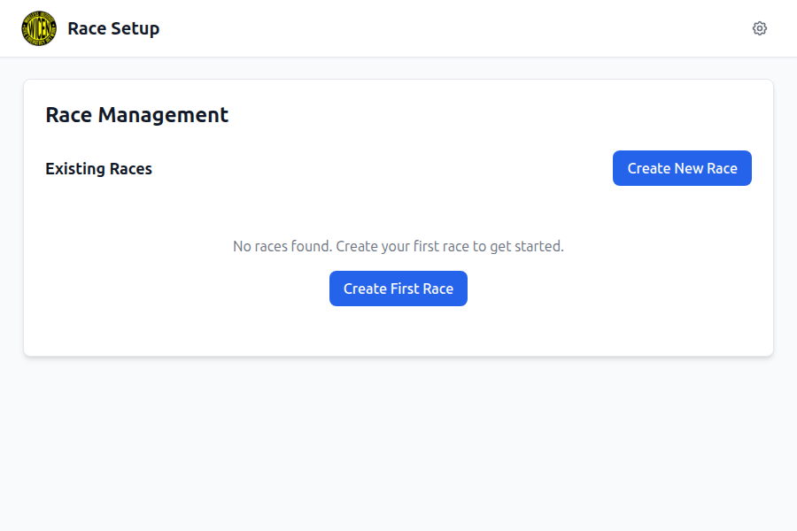
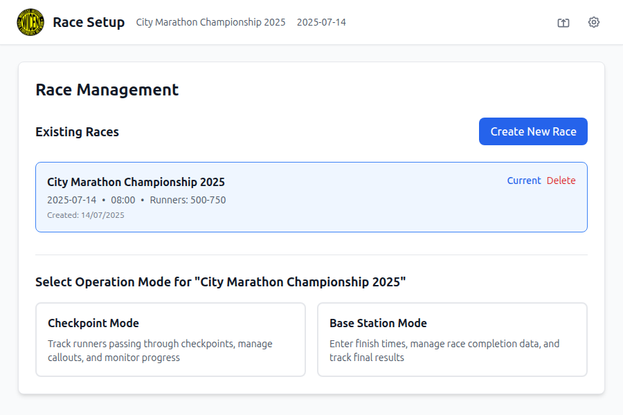
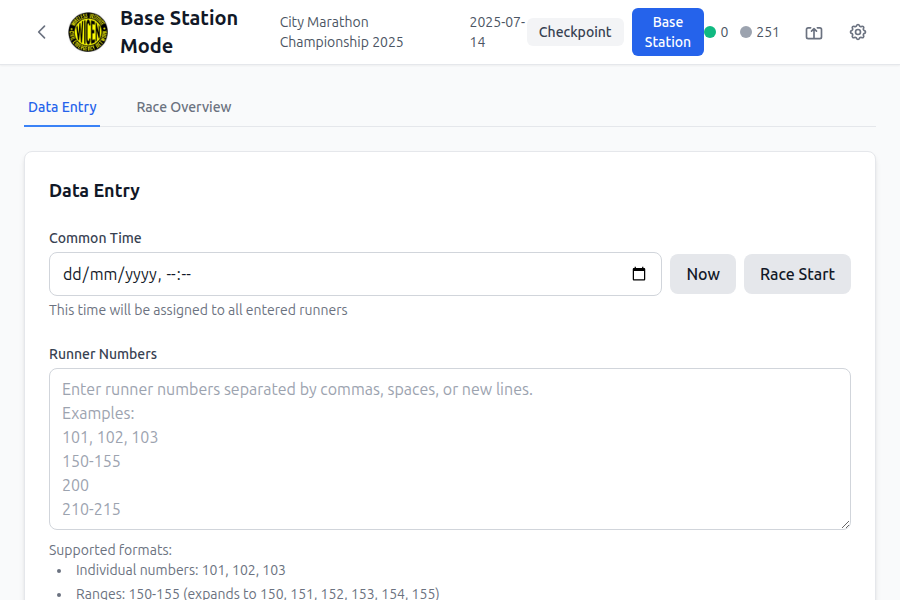

# RaceTracker Pro

An offline-capable race tracking application designed for desktop and mobile platforms. This app streamlines the process of tracking runners during races, supporting both checkpoint and base station operations without requiring an internet connection.

## 📸 Visual Overview

### Application Workflow

*Clean startup interface with race management dashboard*


*Intuitive race setup with flexible runner range configuration*


*Real-time calculations and validation during race creation*

### Operation Modes

*Clear operation mode selection after race creation*


*Checkpoint mode with runner tracking and grouping functionality*


*Base station data entry interface for finish times*

### Race Management

*Comprehensive race statistics and runner management*

### Customization

*Extensive customization options in light theme*


*Professional dark theme with consistent styling*


*Production-ready interface showing complete functionality*

## Features

### 🏃‍♂️ Race Setup
- Create races with customizable date and start time
- Flexible runner number ranges (e.g., 100-200, 1200-1400)
- Local data storage for offline operation
- Configuration sharing via QR code or email

### 📍 Checkpoint Mode
**Tab 1: Runner Tracking**
- Interactive grid/list view of runner numbers
- Search functionality for quick runner lookup
- One-tap marking with automatic timestamp recording
- Grouping and pagination for large runner ranges

**Tab 2: Callout Sheet**
- Automatic 5-minute time segmentation
- Group runners by arrival time intervals
- Mark segments as "called in" to race control
- Chronological organization from earliest to latest

**Tab 3: Overview**
- Complete status dashboard for all runners
- Color-coded status indicators (passed, not started, non-starter, DNF)
- Manual status updates and progress tracking
- Real-time counts and timing information

### 🏁 Base Station Mode
**Tab 1: Data Entry**
- Common time assignment for groups of runners
- Flexible runner input (individual numbers, ranges, bulk entry)
- Batch processing for efficient data management
- Support for formats like "101, 105-107, 110"

**Tab 2: Race Overview**
- Identical to Checkpoint Overview
- Complete runner status management
- Progress monitoring and final results

### ⚙️ Customization & Settings
- **Dark/Light Mode**: Automatic theme switching
- **Font Size**: Adjustable text size for accessibility
- **Status Colors**: Customizable color schemes for each runner status
- **View Modes**: Toggle between grid and list layouts
- **Group Sizes**: Configurable grouping (10, 25, 50, 100 runners)

### 📱 Progressive Web App (PWA)
- **Offline First**: Works completely without internet
- **Installable**: Add to home screen on mobile/desktop
- **Responsive Design**: Adapts to all screen sizes
- **Local Storage**: IndexedDB for persistent data
- **Service Worker**: Caches app for offline use

## Technical Stack

- **Frontend**: React 18 with Hooks
- **Build Tool**: Vite
- **Styling**: Tailwind CSS
- **State Management**: Zustand
- **Database**: IndexedDB with Dexie.js
- **QR Codes**: qrcode.react
- **Date Handling**: date-fns
- **PWA**: Vite PWA Plugin with Workbox

## Installation & Setup

### Prerequisites
- Node.js 16+ and npm

### Development Setup
```bash
# Clone the repository
git clone <repository-url>
cd race-tracker-pro

# Install dependencies
npm install

# Start development server
npm run dev

# Open http://localhost:3000
```

### Production Build
```bash
# Build for production
npm run build

# Preview production build
npm run preview
```

### PWA Installation
1. Open the app in a modern browser
2. Look for the "Install" prompt or use browser's install option
3. The app will be available offline after installation

## Usage Guide

### Getting Started
1. **Create a Race**: Enter race name, date, start time, and runner range
2. **Choose Mode**: Select either Checkpoint or Base Station mode
3. **Start Tracking**: Begin marking runners or entering data

### Checkpoint Operations
1. **Runner Tracking**: Tap runner numbers as they pass through
2. **Callouts**: Monitor 5-minute segments and mark as called
3. **Overview**: Check overall progress and update statuses

### Base Station Operations
1. **Data Entry**: Enter common finish times for groups
2. **Bulk Processing**: Handle multiple runners with same time
3. **Status Management**: Update non-starters and DNFs

### Data Sharing
1. **Export**: Generate QR code or download JSON file
2. **Import**: Scan QR code or paste configuration data
3. **Email**: Share configuration via email

## Browser Support

- **Chrome/Edge**: Full support including PWA features
- **Firefox**: Full support with PWA installation
- **Safari**: Full support on iOS/macOS
- **Mobile Browsers**: Optimized for touch interfaces

## Offline Capabilities

- **Complete Offline Operation**: No internet required after initial load
- **Local Data Storage**: All race data stored in browser's IndexedDB
- **Automatic Caching**: Service worker caches app resources
- **Data Persistence**: Survives browser restarts and device reboots

## Data Management

### Storage
- Race configurations and runner data stored locally
- Settings and preferences persisted across sessions
- Automatic cleanup of old race data (configurable)

### Backup & Restore
- Export race configurations as JSON
- QR code generation for easy device-to-device transfer
- Email sharing for backup purposes

### Privacy
- No data sent to external servers
- All processing happens locally on device
- User controls all data retention and sharing

## Performance Optimizations

- **Virtual Scrolling**: Handles large runner ranges efficiently
- **Lazy Loading**: Components loaded on demand
- **Debounced Search**: Optimized filtering and search
- **Memoization**: Prevents unnecessary re-renders
- **Service Worker**: Aggressive caching for fast load times

## Accessibility Features

- **Keyboard Navigation**: Full keyboard support
- **Screen Reader**: ARIA labels and semantic HTML
- **High Contrast**: Support for high contrast mode
- **Font Scaling**: Adjustable text size
- **Touch Targets**: Optimized for touch interfaces

## Troubleshooting

### Common Issues

**App won't load offline**
- Ensure the app was fully loaded online first
- Check if service worker is registered in browser dev tools

**Data not saving**
- Verify IndexedDB is enabled in browser
- Check available storage space

**QR code not scanning**
- Ensure camera permissions are granted
- Try copying and pasting the JSON data instead

**Performance issues with large runner ranges**
- Use grouping feature to break down large ranges
- Consider splitting very large races into multiple configurations

### Browser Storage Limits
- Most browsers allow 50-80% of available disk space
- Monitor storage usage in browser dev tools
- Use cleanup features for old race data

## Contributing

This is a self-contained application designed for offline race management. For feature requests or bug reports, please refer to the project documentation.

## License

This project is designed for race management and volunteer coordination. Please ensure compliance with local regulations regarding data collection and participant privacy.

## Version History

- **v1.0.0**: Initial release with full checkpoint and base station functionality
- Progressive Web App capabilities
- Offline-first design with local data storage
- QR code sharing and import/export features

---

**RaceTracker Pro** - Streamlining race management, one runner at a time. 🏃‍♀️🏃‍♂️
