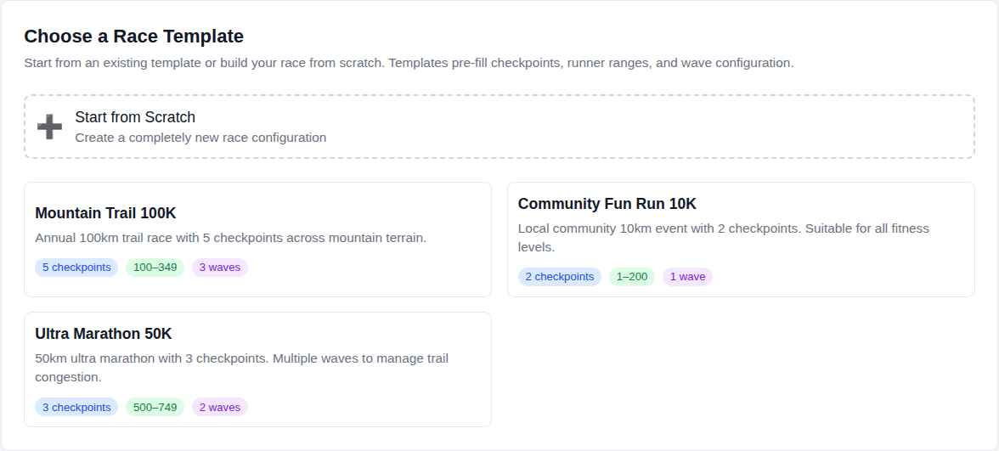
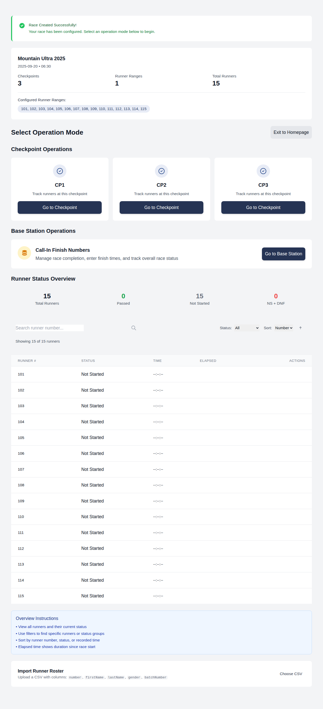
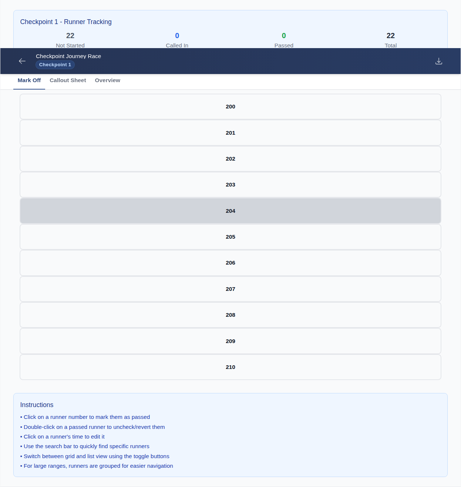
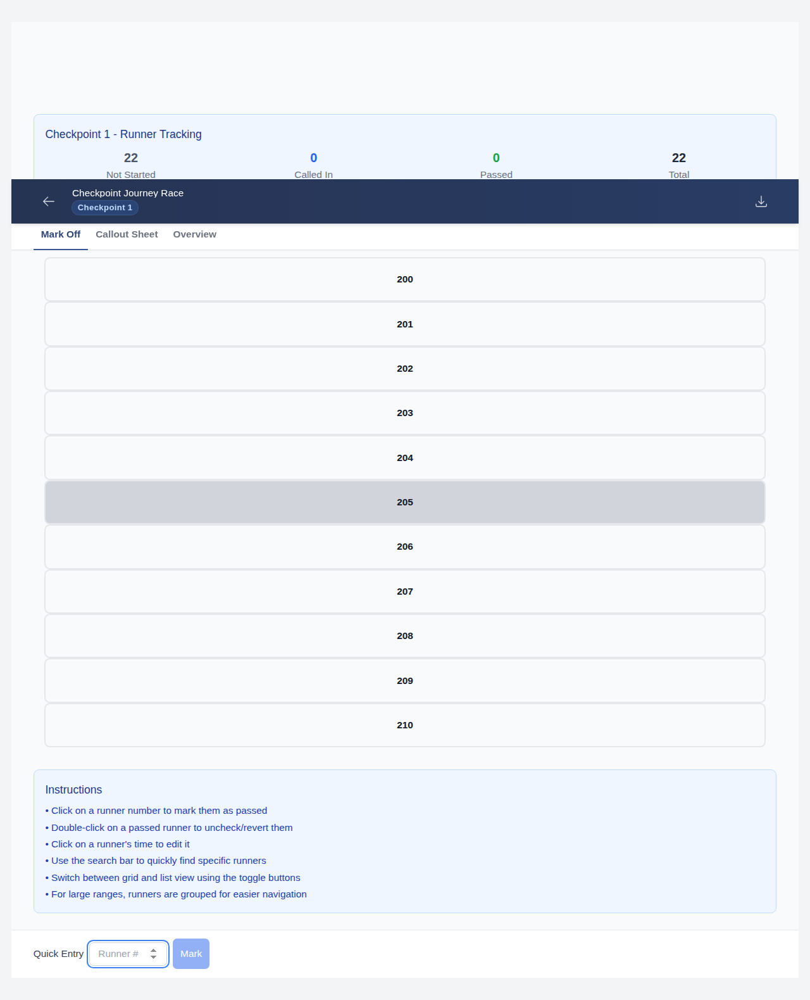
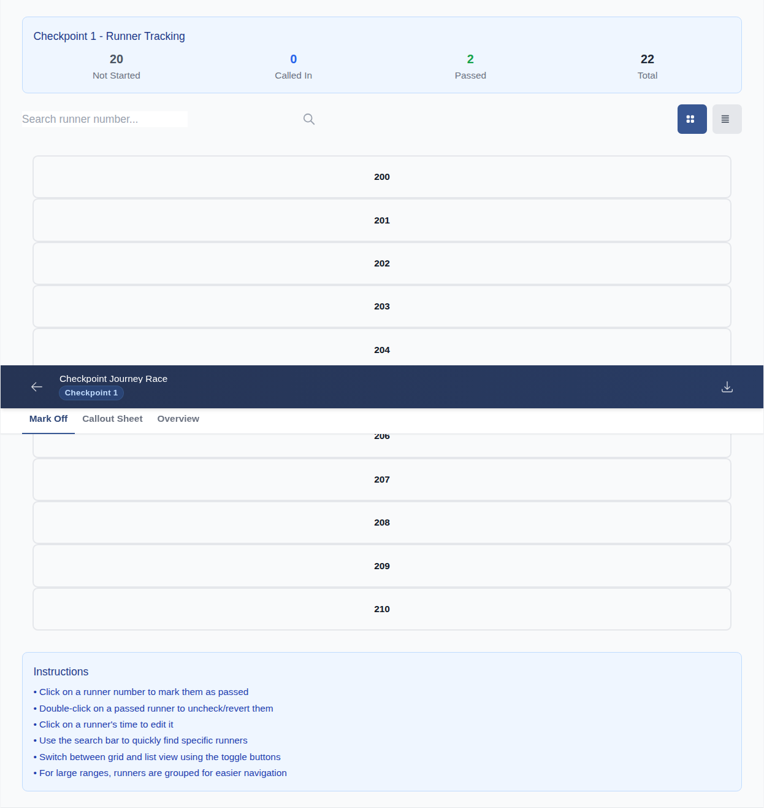
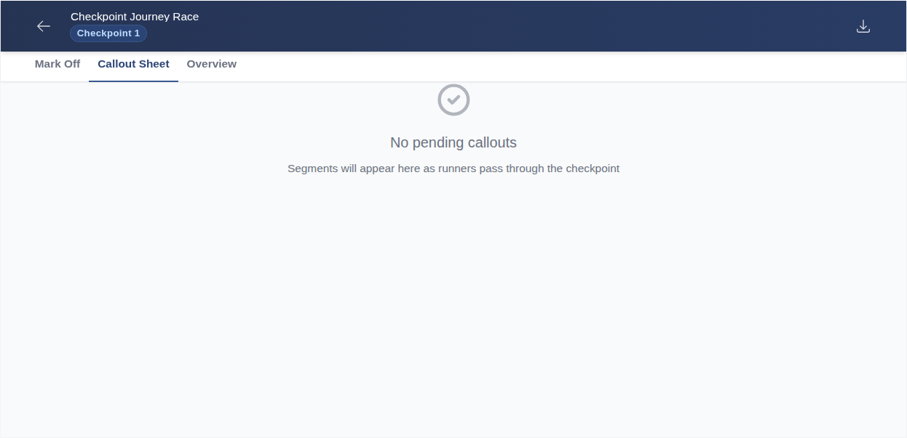
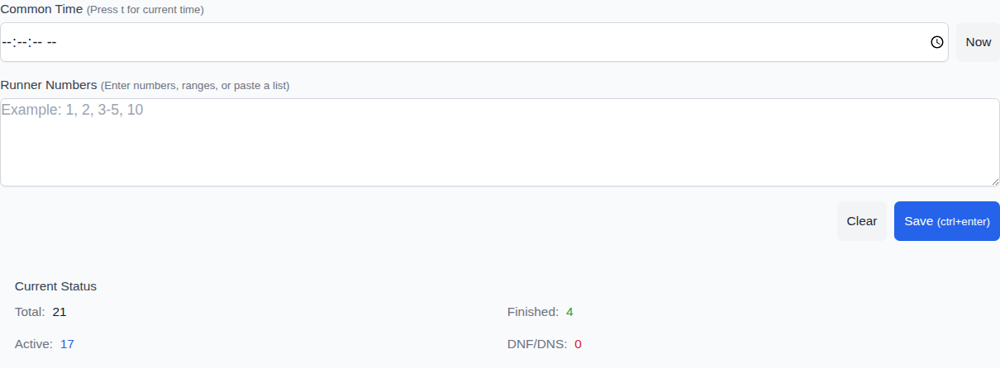
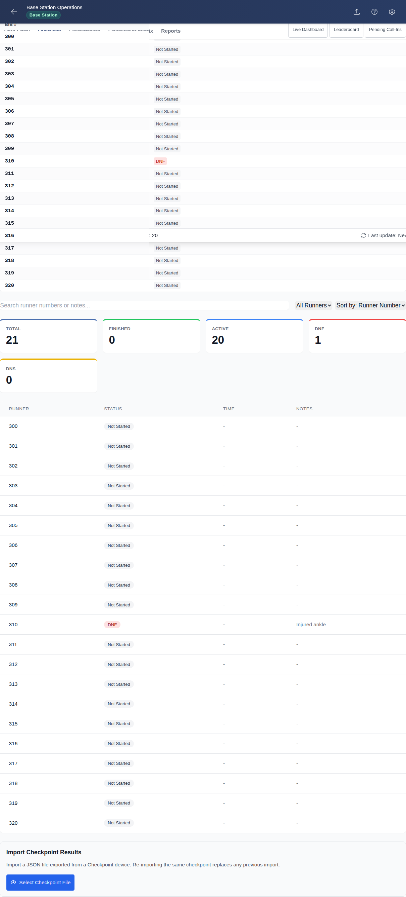

# Race Day Operations — Reference Guide

> **Audience:** Race Director, Checkpoint Volunteers, Base Station Operator  
> **Last updated:** 2026-03-02

This document describes the complete workflow for running a race with RaceTracker Pro — from pre-race setup through to final results. Operations on the day rely on **amateur radio** (VK4 protocol) for communication between checkpoints and base station. Data is collected independently on each device and consolidated after the event.

---

## Overview

```
PRE-RACE          RACE DAY                       POST-RACE
─────────         ────────────────────────────── ─────────────────────
Race Director     Checkpoint Volunteers           Each Checkpoint
  │                 Mark runners as they pass      Export results JSON
  │                 Group into 5-min segments      Email to Race Director
  │                 Call in over radio        ──►
  │                                                Base Station
  │               Base Station Operator            Import all checkpoint
  │                 Receive radio calls            JSON files
  │                 Enter called runners           Compile final results
  │                 Broadcast DNS/DNF back
  │
  ├── Create race in app
  ├── Export race-config.json
  └── Distribute to all devices
        (USB / QR code / email attachment)
```

---

## Phase 1 — Pre-Race Setup (Race Director)

### 1.1 Create the Race

1. Open RaceTracker Pro → **Race Maintenance** → **Create New Race**
2. Complete the 4-step wizard:
   - **Step 1 — Template:** Start from Scratch (or use a saved template)
   - **Step 2 — Race Details:** Enter name, date, start time, number of checkpoints
   - **Step 3 — Runner Setup:** Add bib number ranges (e.g. 101–200) or individual numbers
   - **Step 4 — Waves:** Confirm wave start and save
3. Verify the Race Overview shows the correct checkpoint count and runner total.


*The 4-step wizard walks you through all race configuration in one flow.*


*Race overview confirms correct checkpoint and runner counts before distributing the config.*

### 1.2 Export Race Configuration

1. From the Race Overview, press **Export → Race Config**
2. Save the downloaded `race-config.json` file
3. This file contains: race name, date, start time, checkpoints, and all runner bib numbers

### 1.3 Distribute to All Devices

Each operator (checkpoint volunteers and base station) must have the race config loaded **before** the race starts.

**Distribution methods:**
- USB drive — copy `race-config.json` and physically deliver
- QR code — use the app's built-in QR share (if on the same Wi-Fi)
- Email attachment — send `race-config.json` to each operator's device

### 1.4 Each Operator Imports the Config

On each device:
1. Open RaceTracker Pro → **Race Maintenance** → **Import Race**
2. Select the `race-config.json` file
3. Verify the race name and runner count are correct
4. The device is now ready to operate independently (no network required)

---

## Phase 2 — Race Day Operations

Each device operates **completely offline and independently**. No real-time data sync occurs between devices. All communication is via radio.

---

### 2.1 Checkpoint Volunteer Workflow

#### Opening a Checkpoint

1. Open RaceTracker Pro → **Checkpoint Operations**
2. Select the race from the modal
3. Select your checkpoint number (e.g. CP1)
4. The runner grid shows all registered runners as **Not Started**


*Runner grid at CP1 — all bibs visible, colour-coded by status (grey = Not Started).*

#### Marking Runners as They Pass

As each runner passes through:

- **Quick Entry (recommended for busy checkpoints):**  
  Type bib number(s) into the quick entry field → press Enter  
  Multiple bibs can be entered comma-separated: `101, 103, 107`

- **Grid tap:** Find the runner tile and tap to toggle **Passed**

- **Batch time:** All runners passed at the same real-world time should share the same common time. The app automatically floors to the nearest **5-minute interval** (e.g. runners arriving at 10:47 get common time `10:45`).

| Quick Entry bar | Runners marked off |
|---|---|
|  |  |

#### The Callout Sheet

The **Callout Sheet** tab groups passed runners by their 5-minute common time segment, ready to call in over radio. 

Each segment shows:
- Time label (e.g. `10:45–10:50`)
- Runner count and bib list (e.g. `101, 103, 105–107`)
- **Mark Called** button — press this after you have called the segment in over the radio

Once a segment is marked called, it moves to the "Called Segments" history.


*Callout Sheet showing runners grouped by common time, ready to radio in to base.*

---

### 2.2 Radio Call Procedure (VK4 Protocol)

All communication between checkpoints and base station follows standard VK4 amateur radio procedure.

#### Unofficial Call (no logging at base)

Use for non-scoring matters (conditions, queries, welfare checks):

```
"VK4WIP this is VK4[your callsign]"
```

Base does not need to record anything for an unofficial call.

#### Scores Call (checkpoint calling in results)

When you have a completed time segment ready to call in:

**Step 1 — Alert base**
```
"VK4WIP this is VK4[CP callsign], Scores Checkpoint [N]"
```

**Step 2 — Base acknowledges when logging software is ready**
```
"VK4[CP callsign] this is VK4WIP, go ahead"
```

**Step 3 — Send results** (groups of 10 runners or fewer):
```
"Checkpoint [N] / Common time [HH:MM] / [bib numbers]"
```

> **Example:**  
> "Checkpoint 1 / Common time 09:10 / 101, 103, 105, 107, 109"  
> "Checkpoint 1 / Common time 09:10 / 110, 112 — end of group"

**Step 4 — Checkpoint marks segment called**  
After the base station confirms receipt, press **Mark Called** on that segment in the Callout Sheet.

**Repeat** for each remaining time segment. Calls are typically spaced every 15–30 minutes as segments accumulate.

#### DNS / DNF Broadcast (base station to all checkpoints)

When the base station logs a non-starter (DNS) or did-not-finish (DNF):

```
"VK4WIP this is VK4WIP — runner [bib] is [DNS/DNF] — non-starter/did-not-finish — all checkpoints acknowledge"
```

Each checkpoint operator:
1. Acknowledges: `"VK4WIP this is VK4[CP callsign], acknowledged"`
2. Locates the runner on their grid
3. Updates status to **Non-Starter** or **DNF** as appropriate

---

### 2.3 Base Station Operator Workflow

#### Opening Base Station

1. Open RaceTracker Pro → **Base Station Operations**
2. Select the race from the modal
3. The Data Entry tab opens — ready to receive calls


*Base station data entry view — common time and runner bib fields ready to accept a radio call.*

#### Entering Called Results

When a checkpoint calls in scores:

1. Enter the **Common Time** in the time field (e.g. `09:10`)
2. Enter runner bibs in the runner field (comma-separated: `101, 103, 105, 107, 109`)
3. Press **Submit / Record**
4. Acknowledge over radio and ask the checkpoint to continue with the next group

Repeat for each group (≤10 runners) until the checkpoint says "end of group".

#### Recording DNS (Non-Starter)

For a runner confirmed not at the start:

1. Find the runner in the overview or search by bib
2. Press **DNS / Non-Starter**
3. Broadcast the status to all checkpoints over radio (see above)

#### Recording DNF (Did Not Finish)

When a checkpoint reports a runner has withdrawn:

1. In the **Withdrawal** section, select the runner bib
2. Select the checkpoint where they withdrew
3. Press **Record Withdrawal**
4. Broadcast the status to all checkpoints over radio


*Withdrawal confirmation — runner marked DNF with checkpoint location recorded.*

#### Viewing the Checkpoint Matrix

The **Checkpoint Matrix** tab shows all runners × all checkpoints in a grid — useful for spotting runners who passed one checkpoint but not the next.

---

## Phase 3 — Post-Race Data Collection

### 3.1 Each Checkpoint Exports Their Results

At the end of the race (or after all runners have passed/been accounted for):

1. Open RaceTracker Pro → **Checkpoint Operations** → your checkpoint
2. Press **Export Results**
3. Save the downloaded `checkpoint-[N]-results.json` file
4. This file contains every runner's mark-off time, common time, callout status, and notes

### 3.2 Email Results to Race Director / Base Station

Each checkpoint volunteer emails their `checkpoint-[N]-results.json` to the race director or base station operator.

> These files are small (typically < 100 KB) and can be sent over any email service, including mobile data after the event.

### 3.3 Base Station Imports All Checkpoint Results

For each received checkpoint file:

1. Open RaceTracker Pro → **Base Station Operations**
2. Navigate to the **Import** section
3. Press **Select Checkpoint File** and select `checkpoint-[N]-results.json`
4. The import confirms: checkpoint number and runner count
5. Repeat for every checkpoint file received

Re-importing a checkpoint replaces any previous data for that checkpoint.

### 3.4 Final Results

Once all checkpoints are imported, the **Reports** tab in Base Station Operations provides:

- Full runner list with all checkpoint times
- DNS / DNF / Vet-Out summary
- Checkpoint matrix (all runners × all checkpoints)
- Exportable results for official records

---

## Quick Reference Cards

### Race Director — Pre-Race Checklist

| Step | Action |
|------|--------|
| ☐ | Create race in Race Maintenance |
| ☐ | Verify checkpoint count and runner range |
| ☐ | Export `race-config.json` |
| ☐ | Deliver config to each operator's device |
| ☐ | Confirm each device has imported the race |

### Checkpoint Volunteer — Race Day Checklist

| Step | Action |
|------|--------|
| ☐ | Import race config (if not already done) |
| ☐ | Open Checkpoint Operations → select race → select CP number |
| ☐ | Mark runners as they pass (quick entry or grid) |
| ☐ | Check Callout Sheet tab for pending segments |
| ☐ | Call in each segment over radio when ≥1 segment is ready |
| ☐ | Mark segment Called after base confirms receipt |
| ☐ | Update DNS/DNF status when broadcast from base |
| ☐ | Export results JSON at end of event |
| ☐ | Email results to race director |

### Base Station Operator — Race Day Checklist

| Step | Action |
|------|--------|
| ☐ | Import race config (if not already done) |
| ☐ | Open Base Station Operations → select race |
| ☐ | Acknowledge checkpoint scores calls when ready |
| ☐ | Enter common time + runner bibs for each called group |
| ☐ | Record and broadcast DNS/DNF/Vet-Out as they occur |
| ☐ | Receive emailed checkpoint JSON files after the event |
| ☐ | Import each checkpoint file into Base Station Operations |
| ☐ | Generate and export final results report |

---

## Radio Phraseology Quick Reference

| Situation | Phrase |
|-----------|--------|
| Unofficial contact | `"VK4WIP this is VK4[CS]"` |
| Alert base to score call | `"VK4WIP this is VK4[CS], Scores Checkpoint [N]"` |
| Base ready to receive | `"VK4[CS] this is VK4WIP, go ahead"` |
| Send results | `"Checkpoint [N] / Common time [HH:MM] / [bibs]"` |
| End of a group | append `"— end of group"` |
| Base broadcasts DNS/DNF | `"VK4WIP this is VK4WIP — runner [bib] is DNS — all checkpoints acknowledge"` |
| Checkpoint acknowledges | `"VK4WIP this is VK4[CS], acknowledged"` |

> **[CS]** = your callsign suffix (e.g. VK4ABC)  
> **[N]** = checkpoint number  
> **[bibs]** = runner bib numbers, spoken individually or as a short list, max 10 per group

---

## Data Flow Diagram

```
DEVICE A — Race Director          DEVICE B — Checkpoint 1
┌─────────────────────┐           ┌─────────────────────┐
│  Race Maintenance   │           │ Checkpoint Operations│
│  Creates race       │           │  Marks runners off   │
│  Exports config ────┼──────────►│  Imports config      │
└─────────────────────┘           │  Groups by 5-min seg │
                                  │  Calls in via radio  │
                                  │  Exports results ────┼──► email
                                  └─────────────────────┘

DEVICE C — Checkpoint 2                                        DEVICE D — Base Station
┌─────────────────────┐                                        ┌─────────────────────┐
│ Checkpoint Operations│◄── race-config.json (pre-race) ──────│ Base Station Ops     │
│  Marks runners off   │                                        │  Receives radio calls│
│  Calls in via radio ─┼──────────── VK4 radio ──────────────►│  Enters called data  │
│  Exports results ────┼──────────────────── email ───────────►│  Records DNS/DNF     │
└─────────────────────┘                                        │  Broadcasts back     │
                                                               │  Imports CP exports  │
                                                               │  Final results report│
                                                               └─────────────────────┘
```

---

*Generated from the VK4 amateur radio race timing procedure used at Autumn Ultra and similar events.*
