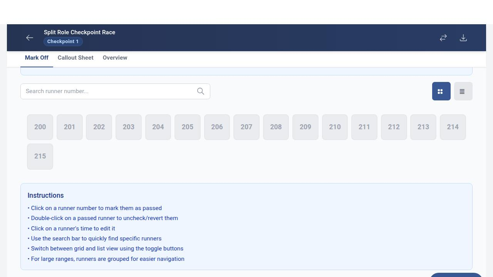
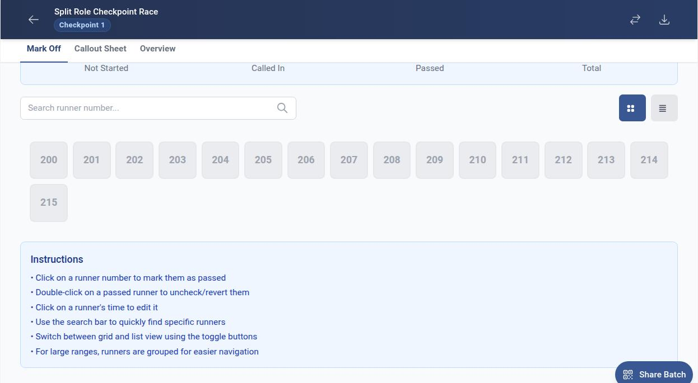
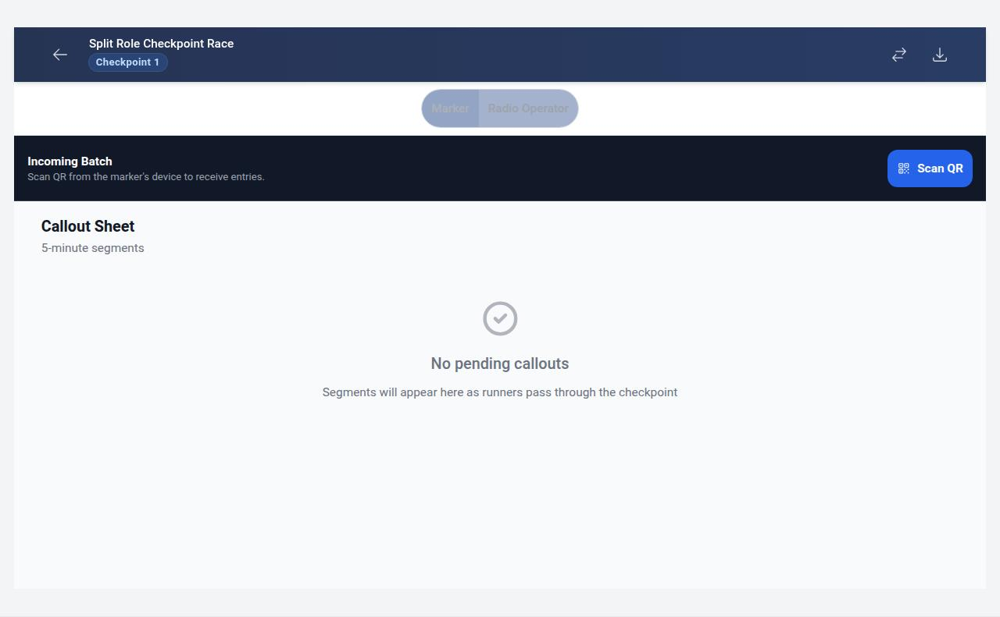
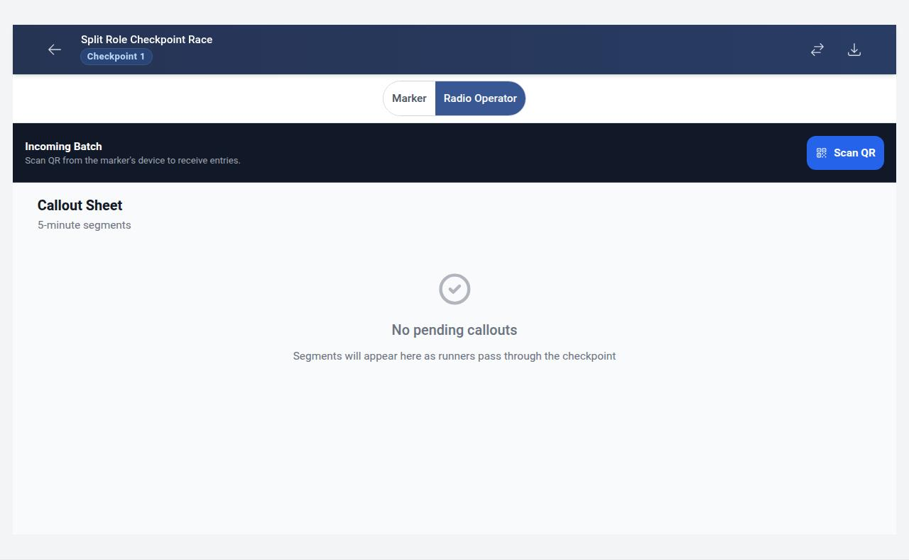
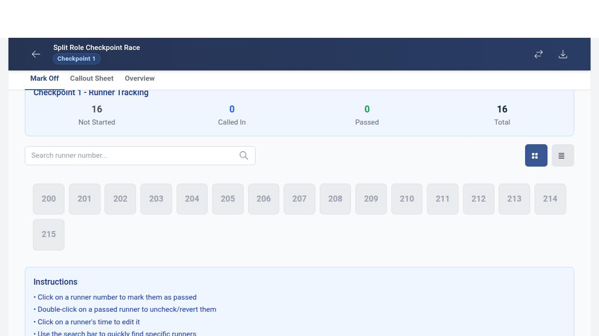
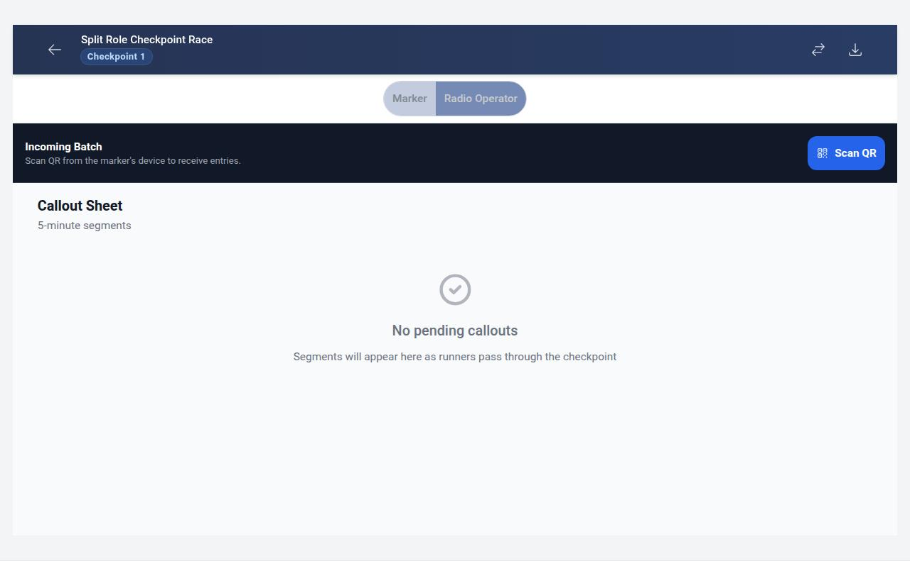
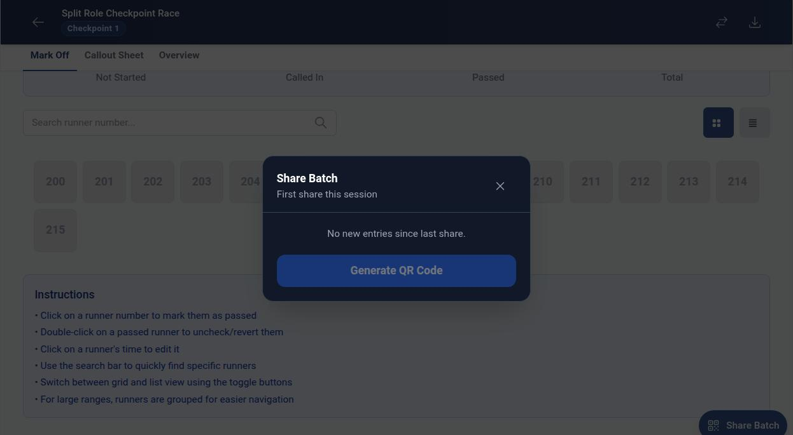

# RaceTracker Pro — User Guide

> This guide is auto-generated from the Playwright journey tests.
> Screenshots show the actual app at each key step.
> Regenerate with: `npm run generate:guide`

## Split-Role Checkpoint Operations

How two operators can share one checkpoint — a Marker records runner times and shares batches via QR code, while a Radio Operator scans the QR and calls runners in to base.

### Checkpoint opens in Marker mode by default

**Navigate to checkpoint 1**

**Role toggle is visible with Marker and Radio Operator buttons**

**Marker mode — runner grid is visible**

### Switching to Radio Operator mode replaces the runner grid with a scan zone

**Navigate to checkpoint 1 in default Marker mode**

**Click Radio Operator toggle button**

**Radio Operator mode — scan zone is visible with Scan QR button**

### Switching back to Marker mode restores the runner grid

**Navigate to checkpoint 1 and switch to Radio Operator**

**Click Marker toggle to switch back**

**Marker mode — runner grid tabs are restored**

### Share Batch button is visible in Marker mode with a QR icon

**Navigate to checkpoint 1 in Marker mode**

**Share Batch FAB is visible with QR icon**

### Share Batch button is hidden in Radio Operator mode

**Navigate to checkpoint 1 in Marker mode**

**Switch to Radio Operator mode**

**Share Batch button is no longer visible**

### Share Batch opens the batch share modal

**Navigate to checkpoint 1 in Marker mode**

**Click Share Batch button**

**Batch share modal appears with Share Batch heading**

